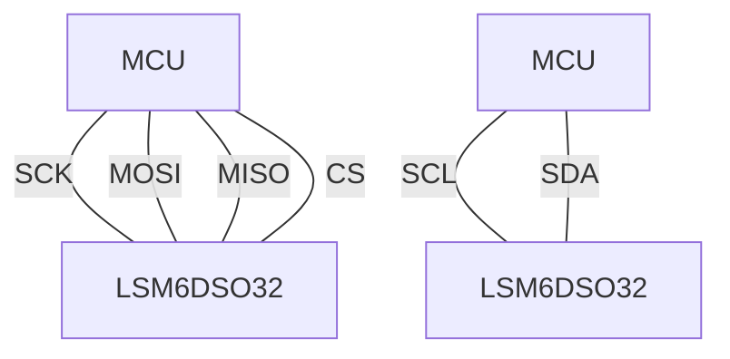
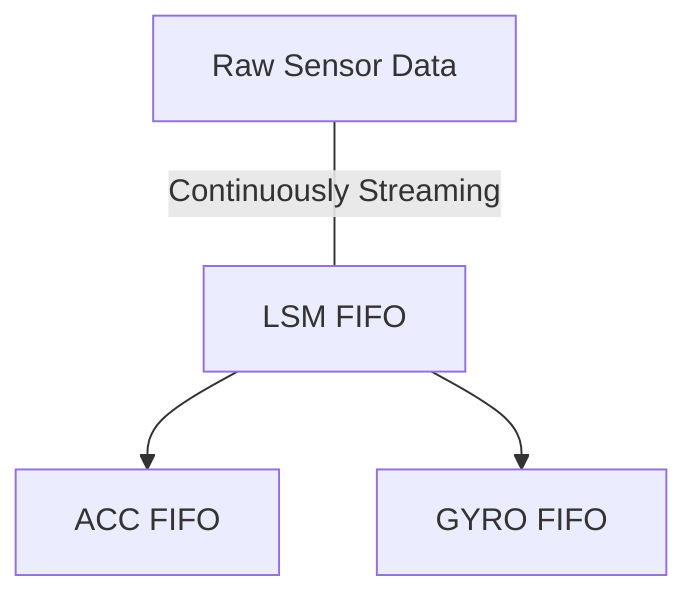

# Arduino-LSM6DSO32
Arduino library for the LSM6DSO32 inertial module https://www.st.com/en/mems-and-sensors/lsm6dso32.html


# Usage
Use the appropriate constructor for your configuration: (see [protocol](https://github.com/TeamSunride/Protocol))
- SPI constructor: (recommended)
```cpp
#define CS_pin 10 // e.g.
SPISettings settings = SPISettings(4000000, MSBFIRST, SPI_MODE0);
LSM6DS032 LSM(CS_pin, SPI, settings);
```
- I2C constructor:
```cpp
LSM6DS032 LSM(&Wire, 1000000);
```


Wiring guide:



With the correct configuration (see `default_configuration()`) calling `fifo_pop` will pop from the LSM FIFO into the acceleration and gyroscope FIFOs.
Note that ACC FIFO and GYRO FIFO are FIFOs of _type_ `Vector<double, 4>`, so they are FIFOs of Vectors.



# Compression
This library correctly implements the built in compression algorithm in the LSM6DSO32 FIFO. In my testing however, the device does not always perform optimally while the onboard compression algorithm is active:


Example: the device outputs 0 on all accelerometer axis while the device is at rest on a desk. This **never** happens using uncompressed data + FIFO.


Example: the device outputs very sharp acceleration values on *all* axis when the device is plonked onto the table. This is not how the device behaves when using uncompressed data.


I am actively investigating these issues - there's a chance there's a bug in my code I'm not seeing.
