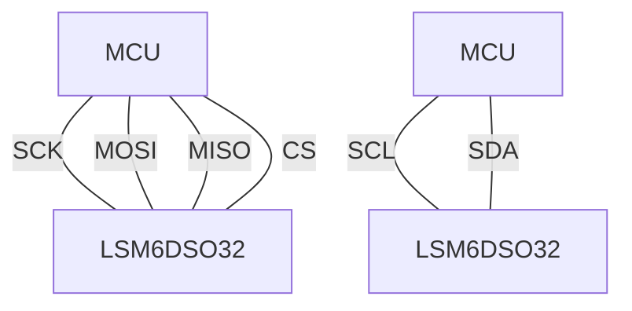
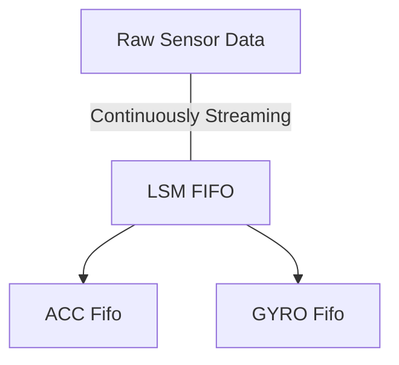

# Arduino-LSM6DSO32
An Arduino library for the [LSM6DSO32](https://www.st.com/en/mems-and-sensors/lsm6dso32.html) inertial module.


# Usage
Use the appropriate constructor for your configuration: (see [protocol](https://github.com/TeamSunride/Protocol))
- SPI constructor: (recommended)
```cpp
#define CS_pin 10 // e.g.
LSM6DS032 LSM(CS_pin, SPI, 4000000);
```
- I2C constructor:
```cpp
LSM6DS032 LSM(&Wire, 1000000);
```


Wiring guide:



With the correct configuration (see `default_configuration()`) calling `fifo_pop` will pop from the LSM FIFO into the acceleration and gyroscope FIFOs.
Note that ACC FIFO and GYRO FIFO are FIFOs of _type_ `Vector<double, 4>`, so they are FIFOs of Vectors.



# Compression
This library correctly implements the built-in compression algorithm in the LSM6DSO32 FIFO.

The compression algorithm onboard the LSM6DSO32 analyses the data and when possible, batches the data in the FIFO in a more compact data format, 
allowing for the 3 kbyte FIFO to have an effective capacity of over 9 kbyte. See the datasheet and application note for more details

The output when using compression is identical to the uncompressed data stream, which means the library correctly decompresses the data:


