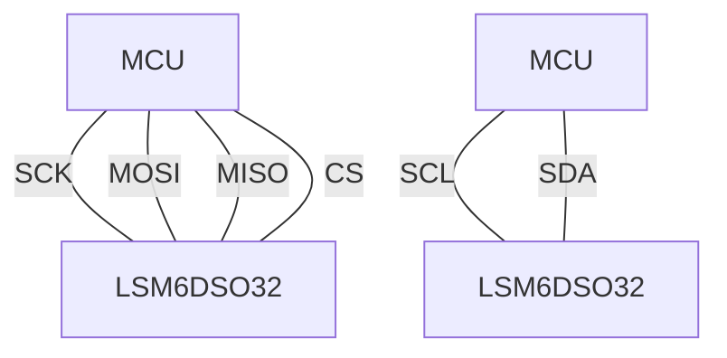
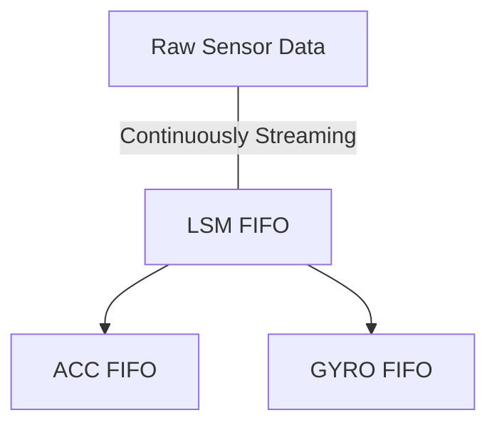

# Arduino-LSM6DSO32
Arduino library for the LSM6DSO32 inertial module https://www.st.com/en/mems-and-sensors/lsm6dso32.html


# Usage
Use the appropriate constructor for your configuration:
- SPI constructor: (recommended)
```cpp
#define CS_pin 10 // e.g.
SPISettings settings = SPISettings(4000000, MSBFIRST, SPI_MODE0);
LSM6DS032 LSM(CS_pin, SPI, settings);
```
- I2C constructor:
```cpp
LSM6DS032 LSM(&Wire, 1000000);
```


Wiring guide:



With the correct configuration (see `default_configuration()`) calling `fifo_pop` will


