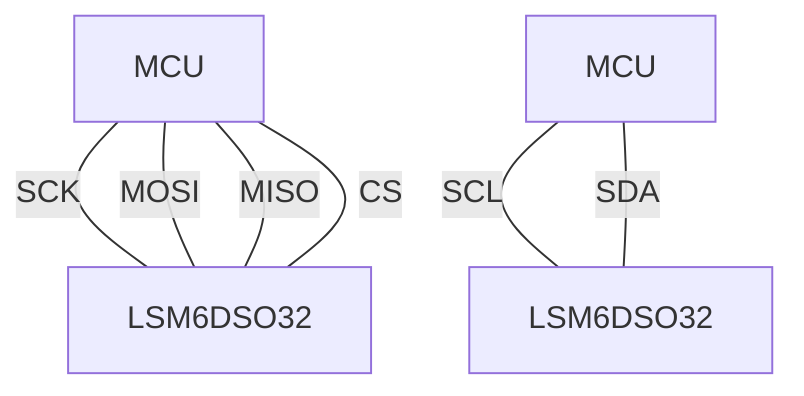
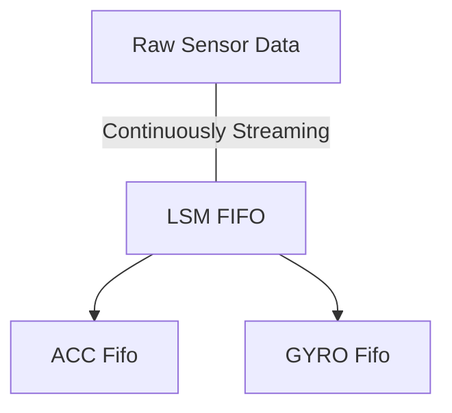

# Arduino-LSM6DSO32
An Arduino / PlatformIO library for the [LSM6DSO32](https://www.st.com/en/mems-and-sensors/lsm6dso32.html) inertial module.


*Image credit: Adafruit*

Developed by [Sam Scott](https://github.com/robosam2003)

# Usage
Use the appropriate constructor for your configuration: (see [protocol](https://github.com/TeamSunride/Protocol))
- SPI constructor: (recommended)
```cpp
#define CS_pin 10 // e.g.
LSM6DSO32 LSM(CS_pin, SPI, 4000000);
```
- I2C constructor:
```cpp
LSM6DSO32 LSM(&Wire, 1000000);
```


Wiring guide:



With the correct configuration (see `default_configuration()`) calling `fifo_pop` will pop from the LSM FIFO into the acceleration and gyroscope FIFOs.
Note that ACC FIFO and GYRO FIFO are FIFOs of _type_ `Vector<double, 4>`, so they are FIFOs of Vectors.



# Compression
This library correctly implements the built-in compression algorithm in the LSM6DSO32 FIFO.

The compression algorithm onboard the LSM6DSO32 analyses the data and when possible, batches the data in the FIFO in a more compact data format, 
allowing for the 3 kbyte FIFO to have an effective capacity of over 9 kbyte. See the datasheet and application note for more details

The output when using compression is identical to the uncompressed data stream, which means the library correctly decompresses the data:


# Filters

The LSM6DSO32 has a number of built-in digital and analogue filters that can be very useful when attempting to eliminate noise.

The `default_configuration()` has a fairly good filter setup, but for specific applications/ other configurations, refer to these diagrams and 
the [datasheet](https://github.com/TeamSunride/Arduino-LSM6DSO32/blob/main/LSM6DSO32_datasheet.pdf) or [application note](https://github.com/TeamSunride/Arduino-LSM6DSO32/blob/main/LSM6DSO-Application-note.pdf):

### Accelerometer Filters


### Gyroscope Filters


# Examples
The [`examples`](https://github.com/TeamSunride/Arduino-LSM6DSO32/tree/main/examples) folder contains some examples of how the LSM6DSO32 can be used.
- Using the BDR counter: [bdr_counter.cpp](https://github.com/TeamSunride/Arduino-LSM6DSO32/blob/main/examples/bdr_counter.cpp)
- Using the BDR counter with interrupts: [bdr_counter_interrupt.cpp](https://github.com/TeamSunride/Arduino-LSM6DSO32/blob/main/examples/bdr_counter_interrupt.cpp) 
- Using the data ready (DRDY) signal: [data_ready_signal.cpp](https://github.com/TeamSunride/Arduino-LSM6DSO32/blob/main/examples/data_ready_signal.cpp)
- Using the data ready (DRDY) signal routed to an interrupt: [data_ready_interrupt.cpp](https://github.com/TeamSunride/Arduino-LSM6DSO32/blob/main/examples/data_ready_interrupt.cpp)
- Directly reading from the registers: [direct_read.cpp](https://github.com/TeamSunride/Arduino-LSM6DSO32/blob/main/examples/direct_read.cpp)
- Using the Fifo, which also demonstrates the compression capabilities: [fifo_with_compression](https://github.com/TeamSunride/Arduino-LSM6DSO32/blob/main/examples/fifo_with_compression.cpp)
- Reading the watermark threshold flag: [watermark.cpp](https://github.com/TeamSunride/Arduino-LSM6DSO32/blob/main/examples/watermark.cpp)
- Using the watermark *interrupt*: [watermark_interrupt.cpp](https://github.com/TeamSunride/Arduino-LSM6DSO32/blob/main/examples/watermark_interrupt.cpp)

To run an example in platformio, run (in library root):

    pio ci ".\examples\direct_read.cpp" -l "." -l "lib/Protocol" -l "lib/Vector" -l "lib/Fifo" -c "platformio.ini"

# Unit testing
In the `tests` folder, there are some tests that run with unity and platformio

Run the unit tests using `pio test`:


